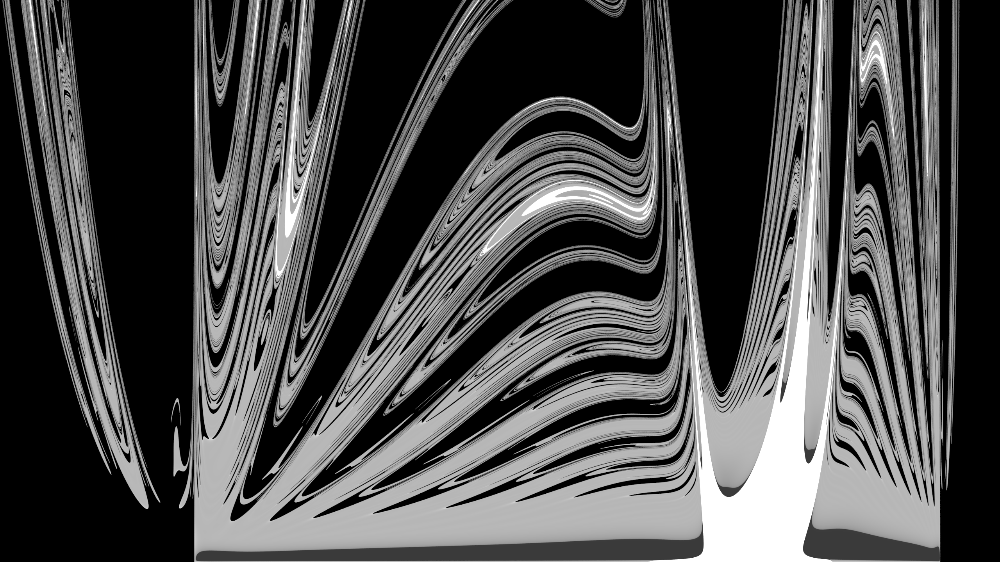

# Lyapunov
Analysing Lyapunov exponent for ODE initial values. Supports midpoint method and RK4 integration.

## To use

Compile with OpenMP support, it will run (for a very long time) and keep updating the output image, lyapunov_l2.png.

## High res output

## Credits

Thanks to Syralia for the more complicated ODE to study, and Sean Barrett for stb_image_write.h.
